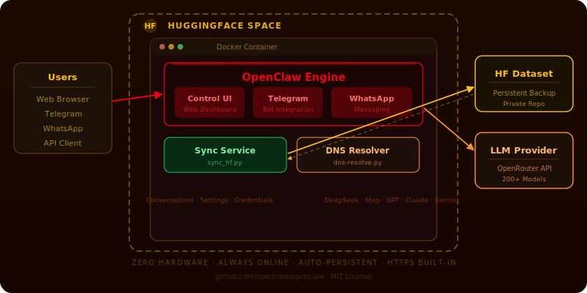

<div align="center">
  
  <br/><br/>
  <strong>The easiest way to deploy <a href="https://github.com/openclaw/openclaw">OpenClaw</a> on the cloud</strong>
  <br/>
  <sub>Zero hardware · Always online · Auto-persistent · One-click deploy</sub>
  <br/><br/>

  [](LICENSE)
  [](https://huggingface.co/spaces/tao-shen/HuggingClaw)
</div>

---

## What is HuggingClaw?

[OpenClaw](https://github.com/openclaw/openclaw) is a self-hosted AI assistant platform with Telegram, WhatsApp integration and a web-based Control UI. It's powerful — but traditionally requires your own server.

**HuggingClaw** solves this by packaging OpenClaw for **one-click cloud deployment** on HuggingFace Spaces. No server, no GPU, no DevOps — just fork, configure secrets, and go.

### Why HuggingFace Spaces?

| Feature | Detail |
|---------|--------|
| **Free compute** | Runs on HF's free CPU tier (2 vCPU, 16 GB RAM) |
| **Always online** | No need to keep your computer running |
| **Auto-persistent** | Syncs data to a private HF Dataset repo on schedule |
| **HTTPS built-in** | Secure WebSocket connections out of the box |
| **One-click deploy** | Fork → set secrets → done |

## Quick Start

### 1. Duplicate this Space

Click **Duplicate this Space** on the [HuggingClaw Space page](https://huggingface.co/spaces/tao-shen/HuggingClaw).

### 2. Set Secrets

Go to **Settings → Repository secrets** and configure:

| Secret | Status | Description |
|--------|:------:|-------------|
| `OPENCLAW_PASSWORD` | Recommended | Password for the Control UI (default: `huggingclaw`) |
| `HF_TOKEN` | **Required** | HF Access Token with write permission ([create one](https://huggingface.co/settings/tokens)) |
| `OPENCLAW_DATASET_REPO` | **Required** | Dataset repo for backup, e.g. `your-name/openclaw-data` |
| `OPENROUTER_API_KEY` | Recommended | [OpenRouter](https://openrouter.ai) API key for LLM access |

> For the full list of environment variables, see [`.env.example`](.env.example).

### 3. Open the Control UI

Visit your Space URL. Click the settings icon, enter your password, and connect.

Messaging integrations (Telegram, WhatsApp) can be configured directly inside the Control UI after connecting.

## Configuration

HuggingClaw is configured entirely through **environment variables**. A fully documented template is provided in [`.env.example`](.env.example).

| Category | Variables | Purpose |
|----------|-----------|---------|
| **Security** | `OPENCLAW_PASSWORD` | Protect the Control UI with a password |
| **Persistence** | `HF_TOKEN`, `OPENCLAW_DATASET_REPO`, `SYNC_INTERVAL` | Auto-backup to HF Dataset |
| **LLM** | `OPENROUTER_API_KEY`, `OPENCLAW_DEFAULT_MODEL` | Power AI conversations |
| **Performance** | `NODE_MEMORY_LIMIT` | Tune Node.js memory usage |
| **Locale** | `TZ` | Set timezone for logs |

For local development, copy the template and fill in your values:

```bash
cp .env.example .env
# Edit .env with your values
```

## Architecture

```
HuggingFace Space (Docker)
│
├── OpenClaw Engine (Node.js)
│   ├── Control UI ─────── Web dashboard (port 7860)
│   ├── Telegram Plugin ── Bot integration
│   ├── WhatsApp Plugin ── Messaging integration
│   └── Agent Workflows ── AI assistants
│
├── Sync Service (sync_hf.py)
│   └── Auto-backup ~/.openclaw ↔ HF Dataset repo
│
├── DNS Resolver (dns-resolve.py)
│   └── Pre-resolve WhatsApp domains via DoH
│
└── Entrypoint (entrypoint.sh)
    └── Orchestrate startup sequence
```

**Data flow:**

```
Users (Browser/Telegram/WhatsApp)
          │
          ▼
   ┌─────────────┐     ┌───────────────┐
   │   OpenClaw   │────▶│  LLM Provider  │
   │   Engine     │◀────│  (OpenRouter)  │
   └──────┬──────┘     └───────────────┘
          │
          ▼
   ┌─────────────┐     ┌───────────────┐
   │    Sync      │────▶│  HF Dataset    │
   │   Service    │◀────│  (Backup)      │
   └─────────────┘     └───────────────┘
```

## Local Development

```bash
git clone https://huggingface.co/spaces/tao-shen/HuggingClaw
cd HuggingClaw

# Configure
cp .env.example .env
# Edit .env — at minimum set HF_TOKEN and OPENCLAW_DATASET_REPO

# Build and run
docker build -t huggingclaw .
docker run --rm -p 7860:7860 --env-file .env huggingclaw
```

Open `http://localhost:7860` in your browser.

## Security

- **Password-protected** — the Control UI requires a password to connect and manage the instance
- **Secrets stay server-side** — API keys and tokens are never exposed to the browser
- **CSP headers** — Content Security Policy restricts script and resource loading
- **Private backups** — the Dataset repo is created as private by default

> **Tip:** Change the default password from `huggingclaw` to something unique by setting the `OPENCLAW_PASSWORD` secret.

## License

MIT
